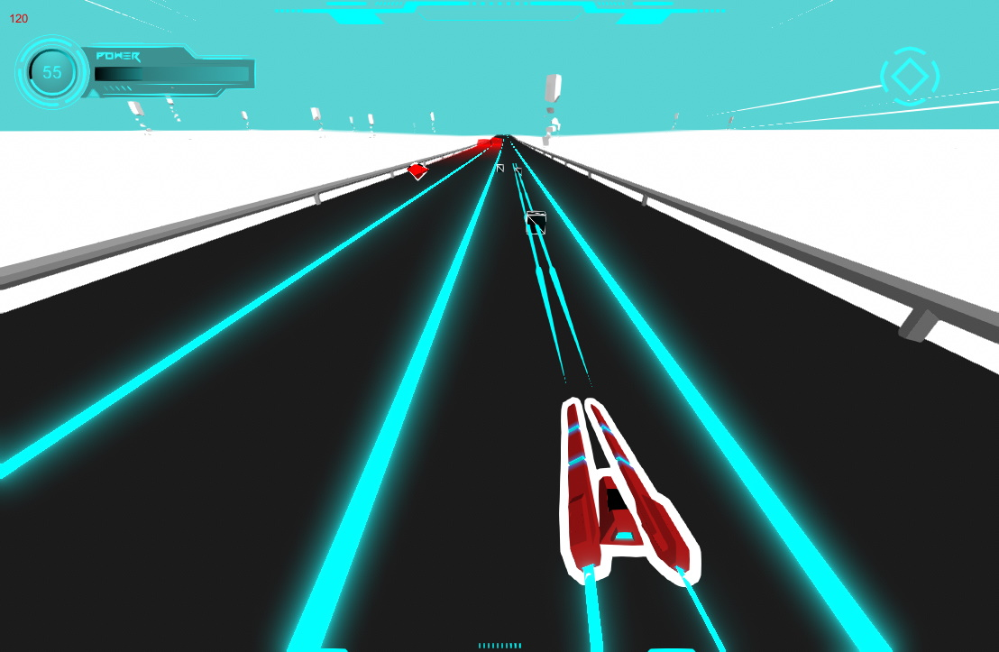

# Collapse

1000 kilometers. The universe is collapsing and your ship is 1000 kilometers away from the nearest singularity, your only hope for survival.
Make no mistake, pilot.

Collapse is a vertical shooter where any mistake is fatal.
Fight your way to salvation while avoiding all obstacles on your way in this collapsing hell.

## Tech stack

Unity, raw meshes and Hlsl shaders.

Meant for desktop play, with keyboard or controller input.

[Download a version to play](https://github.com/Ikeiwa/Collapse/releases/latest)

## Contributing

This project is originally a student project by two french devs, pushed a little further.
All content in this repository not otherwise licenced fall upon the [Creative commons BY-SA-NC](https://creativecommons.org/licenses/by-nc-sa/4.0/) licence.
You are free to reuse, copy, fork the content of this repository for any non commercial purposes, as long as you give credit and share with the same licence. 
Pull requests are welcome. We are open for comercial negociations.

Rights owner: 
Evann Delaunay "Ikeiwa" 
Nicolas Candela "Darkxell" 
Both with full rights over the project in any state in this git repository, except for all proprietary assets not falling under this licence.
